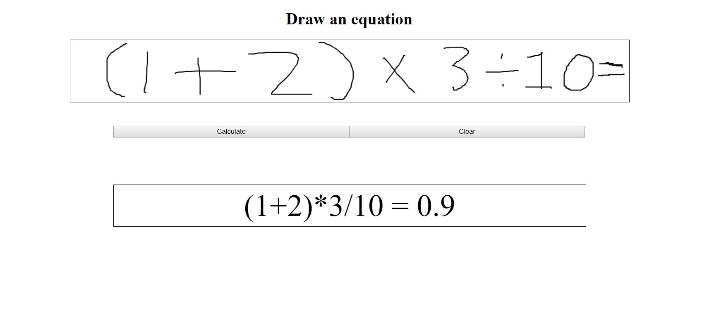

# Linear Equation Solver

This application solves a linear equation involving the following operators and numbers. Note that the calculation follows the standard operator precedence.
1. Numbers from 0 to 9
2. +, -, / or ÷, *
3. (, )
4. =

Drawing an = at the end of the end of an equation is completely optional.

A demo window is shown below

